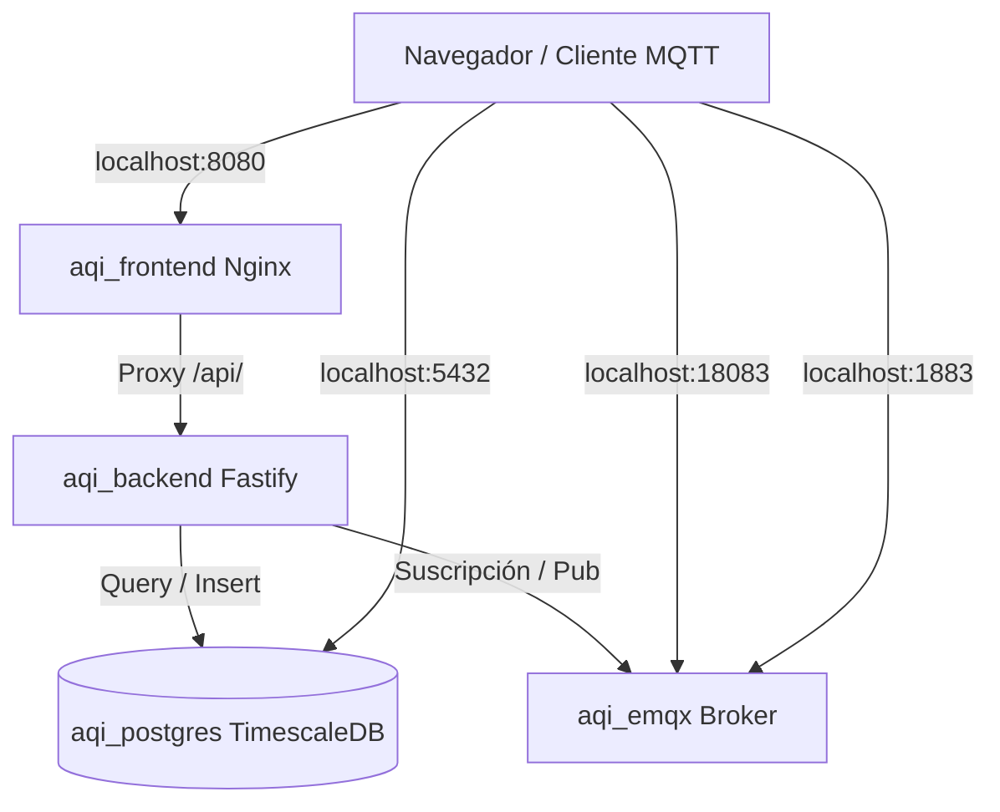

# 💻 Guía de Despliegue Local de Microservicios - OmniSens

Esta guía describe los pasos necesarios para levantar, configurar y probar toda la plataforma de microservicios de **OmniSens** en tu computadora local (Windows) utilizando Docker Desktop.

---

## 🗺️ Arquitectura de Desarrollo Local

En tu máquina local, la plataforma corre de forma autocontenida y expone los puertos necesarios directamente a tu `localhost`:



---

## 📋 Requisitos Previos

Antes de iniciar, asegúrate de tener instalado en tu computadora:
1. **Docker Desktop** (con soporte para Linux Containers y WSL 2 activo).
2. **Git** (opcional, para control de versiones).
3. Un cliente MQTT para pruebas, como **MQTTX** (descargable en [mqttx.app](https://mqttx.app/)) o la herramienta CLI `mosquitto_pub`.

---

## 🚀 Paso a Paso para el Despliegue

### Paso 1: Configurar el Entorno Local
Docker Compose utiliza un archivo `.env` en la raíz para configurar contraseñas y variables de entorno por defecto. Copia el archivo de variables base en la raíz de la carpeta `OmniSens`:

Crea un archivo `.env` en la raíz (si no existe) con el siguiente contenido de desarrollo básico:

```env
POSTGRES_USER=postgres
POSTGRES_PASSWORD=root
POSTGRES_DB=aqi_db
MQTT_BACKEND_USER=backend_service
MQTT_BACKEND_PASS=backend_pass
JWT_SECRET=supersecret_hs256_key_for_development
FRONTEND_PORT=8080
```

> [!NOTE]
> Hemos configurado un archivo `docker-compose.override.yml` en la raíz. Este archivo expone los puertos hacia tu máquina Windows y monta el script de base de datos automático sin interferir con las configuraciones del script Ansible/AWS.

### Paso 2: Compilar y Levantar el Stack
Abre tu terminal (PowerShell o CMD) en la raíz del proyecto `OmniSens` y ejecuta el comando de levantamiento:

```bash
# Compilar las imágenes y levantar los contenedores en segundo plano
docker compose up --build -d
```

*Este comando descargará las imágenes base de TimescaleDB y EMQX, compilará la API backend de Node/TypeScript, compilará el frontend en Vue 3 y configurará los mapeos correspondientes.*

---

## 🔍 Paso 3: Verificación de Servicios

Una vez que termine el proceso de levantamiento, ejecuta el siguiente comando para confirmar que los 4 contenedores están en estado de ejecución (`Up`):

```bash
docker ps
```

Deberías ver una salida similar a esta:
- `aqi_frontend` expuesto en el puerto `8080` de tu máquina.
- `aqi_backend` expuesto en el puerto `3000` de tu máquina.
- `aqi_emqx` expuesto en los puertos `1883` (MQTT), `8883` (MQTTS) y `18083` (Dashboard).
- `aqi_postgres` expuesto en el puerto `5432`.

### 1. Acceso a las Interfaces Web

* **Frontend de la Aplicación**:
  Abre tu navegador e ingresa a [http://localhost:8080](http://localhost:8080).
  * **Acceso**: Usa el correo `admin@omnisens.com` (la contraseña puede ser cualquiera).
  * *Cómo funciona:* Gracias a la configuración del frontend, Nginx redirige automáticamente todas las peticiones a `/api/*` al backend de Fastify usando el bypass de desarrollo para el token `mock_jwt_token_12345`.

* **Dashboard del Broker EMQX**:
  Ingresa a [http://localhost:18083](http://localhost:18083).
  * **Usuario por defecto**: `admin`
  * **Contraseña por defecto**: `public` (el sistema te pedirá cambiarla en el primer ingreso; puedes omitirlo para pruebas rápidas).

### 2. Base de Datos Sembrada Automáticamente
El contenedor `aqi_postgres` se inicia utilizando el archivo `configuraciones/init-db.sql`. Esto crea el esquema relacional con TimescaleDB y precarga los siguientes datos semilla:
- **Cliente**: `Cliente Demo Local` (`client_id: 1`).
- **Usuario**: `admin@omnisens.com`.
- **Dispositivos**:
  - `AQC_001` (MAC: `c8:f0:9e:01:02:03`, Nombre: *Nodo Central Oficina*).
  - `AQC_002` (MAC: `c8:f0:9e:04:05:06`, Nombre: *Nodo Exterior Patio*).

Puedes conectarte a la base de datos utilizando herramientas como DBeaver o pgAdmin con las siguientes credenciales:
- **Host**: `localhost`
- **Puerto**: `5432`
- **Base de datos**: `aqi_db`
- **Usuario**: `postgres`
- **Contraseña**: `root`

---

## 📡 Paso 4: Pruebas de Envío de Telemetría (MQTT)

Para validar que la ingesta de datos funciona en tiempo real desde la PC hacia la base de datos:

1. Abre tu cliente MQTT (como **MQTTX**) y conéctate al broker local:
   - **Host**: `mqtt://localhost`
   - **Puerto**: `1883`
   - **Username**: `backend_service`
   - **Password**: `backend_pass`

2. Publica un mensaje de telemetría simulada en el tópico del dispositivo `AQC_001`:
   * **Tópico**: `aqi/telemetry/AQC_001/data`
   * **Payload (JSON)**:
     ```json
     {
       "pm25": 15.8,
       "pm10": 29.4,
       "co2": 425.0,
       "temp": 23.8,
       "hum": 46.2
     }
     ```

3. **Verifica los Logs del Backend**:
   Ejecuta en tu terminal para ver en tiempo real cómo el backend recibe y procesa el mensaje MQTT:
   ```bash
   docker logs -f aqi_backend
   ```
   *Deberías ver un log que dice:* `💾 Telemetría guardada para dispositivo: AQC_001`.

4. **Verifica en la Base de Datos**:
   Si ejecutas una consulta SQL en `aqi_db`, verás que el registro se ha guardado en la tabla de series de tiempo `air_quality_data`:
   ```sql
   SELECT * FROM air_quality_data ORDER BY time DESC LIMIT 1;
   ```

---

## 🛡️ Coexistencia con el Despliegue en AWS/Ansible

Esta configuración ha sido diseñada meticulosamente para **no alterar** la estructura de producción:
* **No altera `docker-compose.yml`**: Este archivo sigue intacto manteniendo el estándar multi-red necesario.
* **No altera `Despliegue/`**: Los archivos `.j2` y playbooks de Ansible no se modifican. En el entorno de producción, Ansible inyectará sus propios overrides de red (sin puertos expuestos localmente en la netbook) y configuraciones SSL para AWS.
* **Bypass de Desarrollo**: La validación de JWT incluye un bypass controlado únicamente aplicable si se usa el frontend simulado, garantizando que en producción con tokens reales el flujo permanezca 100% seguro.

---

## 🛑 Detener y Limpiar el Entorno

Cuando termines de realizar tus pruebas locales, puedes apagar los servicios con:

```bash
docker compose down
```

Si deseas borrar los volúmenes de datos creados (para reiniciar la base de datos a su estado original):

```bash
docker compose down -v
```
