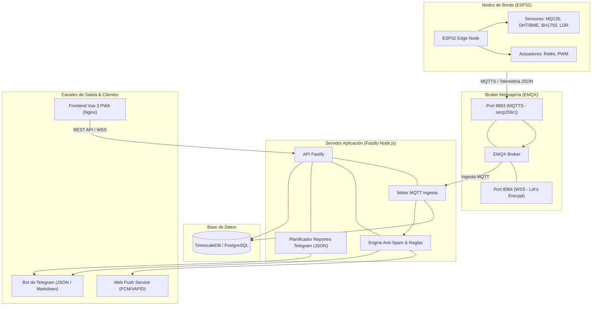

# 📑 Compendio de Documentación Técnica: Plataforma OmniSens & Edge Nodes

## 1. 🌟 Introducción y Arquitectura General del Sistema

**OmniSens** es una plataforma de Monitoreo de Calidad del Aire y Eficiencia Ambiental IoT (Internet of Things) de grado industrial/comercial. El sistema integra captura de datos de alta frecuencia en el borde (*Edge Computing*), transporte seguro de telemetría a través de protocolos optimizados (*MQTTS/WSS*), almacenamiento temporal e hidrométrico hiper-escalable (*TimescaleDB/PostgreSQL*) y una consola cliente interactiva y progresiva (*Vue 3 PWA*).

---

## 2. 🎛️ Nodos de Borde (Firmware ESP32 Edge)

El firmware de los nodos reside en `Dispositivos/controlador_edge_v01mqtt/Omnisens_AQC`. Está estructurado en código modular C++ sobre **PlatformIO**.

### 2.1. Arquitectura Modular del Firmware (`lib/`)
* **`NetworkManager`**: Gestiona la conectividad de red. Si no existe conexión Wi-Fi almacenada en NVS, inicia el **Portal Cautivo (WiFiManager)** para configuración en caliente.
* **`MQ135Sensor`**: Manejo del sensor de gases de aire (CO2, NH3, benceno, alcohol). Implementa curva de calibración dinámica con resistencia de carga $R_0$ calculada en zona muerta ADC.
* **`AHT25Sensor` / `BMP280Sensor`**: Captura de temperatura (°C), humedad relativa (%) y presión atmosférica (hPa).
* **`BH1750Sensor` / `LDRSensor`**: Medición de iluminancia (Lux) y porcentaje de luz ambiental.
* **`DustSensor`**: Sensor óptico de partículas en suspensión ($PM_{2.5}$ / $PM_{10}$).
* **`SalidasRele` & `SalidaPWM`**: Control local de actuadores (extractores, persianas, ventilación por PWM).
* **`RulesEngine`**: Ejecución de reglas en el borde. Permite activar relés sin depender de la nube en caso de pérdida de enlace.
* **`StatusLED`**: Control de señales luminosas RGB (Modo configuración, buscando Wi-Fi, conectado, error de lectura).

### 2.2. Aprovisionamiento Seguro por MQTT (HMAC-SHA256)
El nodo no requiere almacenar contraseñas estáticas de base de datos ni tokens fijos:
1. El nodo se conecta a `aqi/provisioning/request` enviando su dirección MAC física y `timestamp`.
2. El Backend calcula una clave HMAC-SHA256 combinando el `timestamp` con la clave secreta única (`hmac_secret`) guardada en base de datos.
3. El Backend responde en `aqi/provisioning/response/{MAC}` enviando credenciales temporales MQTT para autorizar la publicación en `aqi/telemetry/{device_id}/data`.

---

## 3. 🖥️ Backend de la Nube (Fastify & Node.js)

Ubicado en la carpeta `backend/`, el backend es una API REST y un servicio de ingesta distribuido escrito en **TypeScript**.

### 3.1. Componentes Clave del Backend
* **Fastify Web Framework**: API ultrarrápida con validaciones y middleware de autenticación **JWT** (`plugins/jwt.ts`).
* **Kysely Query Builder**: Acceso a base de datos de tipo seguro (`src/config/db.ts`) conectado a PostgreSQL/TimescaleDB.
* **Motor MQTT (`src/services/mqtt.ts`)**:
  * Escucha `aqi/telemetry/+/data` para guardar lecturas en la tabla hipertabla `air_quality_data`.
  * Escucha eventos `$SYS/brokers/+/clients/+/disconnected` para detectar desconexión de hardware e informar cambio a `offline`.
  * **Sistema Anti-Spam de Reglas (Delta & State Machine)**: Mantiene un mapa en memoria (`ruleStates`). Evita el envío repetitivo de alertas notificando **únicamente en cambios de estado** (Normal $\rightarrow$ Alarma $\rightarrow$ Normal) o si ocurre una variación $\ge 10\%$ respecto a la última alerta.
* **Servicio de Notificaciones Push (`src/services/webpush.ts`)**: Emisión de alertas en tiempo real a navegadores clientes compatibles utilizando llaves VAPID.
* **Servicio de Reportes de Salud por Telegram (`src/services/healthReport.ts`)**:
  * Ejecuta una tarea programada cada 1 hora.
  * Recopila el estado de batería, intensidad de señal Wi-Fi, valores de sensores y actuadores de todos los nodos activos.
  * Formatea la información en un objeto JSON limpio y la envía como bloque de código Markdown a Telegram.

---

## 4. 🗄️ Modelo de Datos (TimescaleDB / PostgreSQL)

Las tablas principales en `aqi_db` son:

1. **`devices`**:
   * `device_id` (PK), `mac_address`, `device_name`, `client_id`, `hmac_secret`, `status`, `last_connection`, `deleted_at`.
2. **`air_quality_data` (Hipertabla TimescaleDB por `time`)**:
   * `time` (TIMESTAMPTZ), `device_id`, `pm25`, `pm10`, `co2`, `temp`, `hum`, `pres`, `l`, `lux`, `battery`, `r1`, `r2`, `pwm`.
3. **`device_rules`**:
   * `rule_id`, `device_id`, `metric`, `condition` (`>`, `<`, `==`), `threshold`, `hysteresis`, `action`, `priority`.
4. **`push_subscriptions`**:
   * `id`, `client_id`, `endpoint`, `auth`, `p256dh`, `created_at`.
5. **`system_alerts_log`**:
   * `device_id`, `alert_type`, `last_sent_at`.

---

## 5. 🌐 Consola Web (Frontend Vue 3 PWA)

Ubicada en la carpeta `frontend/`, la consola web está construida con **Vue 3, TypeScript, Chart.js / Vue-ChartJS y TailwindCSS**.

### 5.1. Vistas Principales
* **`DashboardView.vue`**: Panel principal interactivo con métricas en tiempo real, widgets visuales de calidad de aire, temperatura, humedad y control directo de relés/actuadores.
* **`AnalyticsView.vue`**: Análisis histórico de tendencias con gráficos interactivos, filtrado por rangos de fechas y exportación a CSV/PDF.
* **`DeviceManagerView.vue`**: Alta, baja, edición de parámetros y monitoreo del estado en línea de los nodos de sensores.
* **`RulesEngineView.vue`**: Interfaz de configuración de reglas y alertas personalizadas para cada métrica ambiental.
* **`LoginView.vue` / `RegisterView.vue`**: Autenticación segura y gestión de sesiones mediante tokens JWT.

---

## 6. 🚀 Infraestructura & Despliegue en Producción (AWS EC2)

El despliegue está orquestado mediante **Docker Compose** en una instancia AWS EC2.

### 6.1. Optimización para Instancias Pequeñas (t2.micro)
Debido a las limitaciones de memoria RAM de `t2.micro` (1 GB RAM), el proceso de compilación de código TypeScript (`tsc` y `vite build`) se realiza **localmente en el entorno de desarrollo**, generando:
* `frontend/dist`: Sirviendo directamente mediante Nginx.
* `backend/dist.zip`: Empaquetado y transferido por SFTP al servidor, omitiendo el consumo de compilación en la nube.

### 6.2. Arquitectura Docker Compose
* **`aqi_postgres`**: Contenedor TimescaleDB PG15.
* **`aqi_emqx`**: Broker de mensajería MQTT con puertos seguros MQTTS (8883) y WSS (8084).
* **`aqi_backend`**: Servicio Node.js corriendo la versión pre-compilada del backend (`Dockerfile.prod`).
* **`aqi_frontend`**: Servidor Nginx que maneja certificados SSL (Let's Encrypt / HTTPS), sirve los archivos estáticos de la PWA y hace Proxy Reverso hacia la APIREST del backend.
