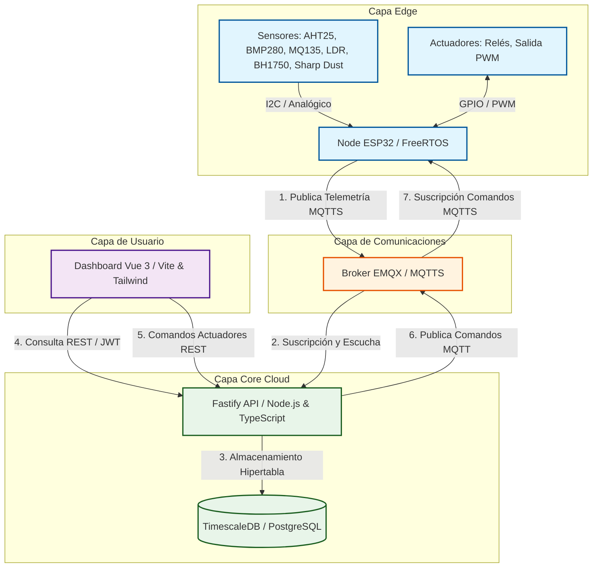

# 🏗️ Arquitectura y Funcionalidades de la Plataforma OmniSens

Este documento presenta una descripción detallada de la arquitectura de sistema, flujo de datos, modelo de persistencia y estructura funcional de **OmniSens**, una plataforma de Internet de las Cosas (IoT) de grado industrial diseñada para la monitorización ambiental, automatización inteligente y gestión remota de dispositivos en tiempo real.

---

## 1. Vista General del Sistema

OmniSens emplea una topología **Edge-to-Cloud** distribuida y contenedorizada. Los datos de telemetría fluyen desde los sensores físicos en campo hasta el panel de usuario mediante una red de comunicación asíncrona segura.



---

## 2. Capa Física y Firmware (Edge)

Los nodos de hardware están controlados por un microcontrolador **ESP32** ejecutando firmware desarrollado en **C++** sobre el framework **PlatformIO**.

### 2.1 Multitarea Resiliente (FreeRTOS)
El firmware distribuye las tareas críticas en los dos núcleos físicos del ESP32 para garantizar un funcionamiento libre de bloqueos (*zero-blocking*):
*   **Core 1 - `TaskSensors` (Lectura pasiva)**:
    *   Frecuencia de muestreo: Cada 5 segundos.
    *   Lee datos físicos a través del bus I2C (temperatura/humedad del AHT25, presión/temperatura del BMP280) y canales analógicos (calidad de aire del MQ135, luminosidad del LDR).
    *   Utiliza un semáforo (`sensorMutex`) y memoria estática (`StaticJsonDocument`) para actualizar de forma segura el búfer JSON de telemetría, evitando pánicos de fragmentación de memoria en el Heap.
    *   Reinicia el Watchdog de Tarea (`esp_task_wdt_reset()`).
*   **Core 0 - `TaskNetwork` (Comunicación activa)**:
    *   Mantiene la conexión WiFi y el cliente MQTT.
    *   Monitorea el pin GPIO 0 para arrancar el **Portal Cautivo de Aprovisionamiento** (`WiFiManager` asíncrono) si el usuario presiona el botón físico.
    *   Toma el semáforo `sensorMutex` para leer el búfer de datos e inserta la telemetría en el canal de red mediante publicaciones hacia el broker MQTT.
    *   Maneja de forma asíncrona la descarga de firmware para actualizaciones **OTA (Over-The-Air)**.

### 2.2 Aprovisionamiento Dinámico (Zero-Touch)
1.  **Arranque Inicial**: El dispositivo inicia; si no detecta una clave criptográfica almacenada en su memoria no volátil (NVS), se conecta al Broker EMQX utilizando su **dirección MAC** como credencial provisional.
2.  **Sandbox de Registro**: El broker limita el acceso del dispositivo sin provisionar al tópico de solicitud `aqi/provisioning/request`.
3.  **Generación de Token**: El backend recibe la petición, valida si la MAC está registrada en la base de datos de dispositivos autorizados y calcula un hash **HMAC-SHA256** único mediante una clave simétrica maestra.
4.  **Almacenamiento Persistente**: El hash se devuelve en el tópico de respuesta `aqi/provisioning/response/<MAC>`. El ESP32 lo recibe, lo graba en su partición NVS y se reinicia de manera automática.
5.  **Acceso Final**: En los arranques posteriores, el ESP32 se autentica con su dirección MAC y el token HMAC calculado, ganando acceso completo al tópico de telemetría `aqi/telemetry/<MAC>/data` y comandos `aqi/commands/<MAC>/*`.

---

## 3. Capa de Transporte (Broker MQTT)

El sistema utiliza **EMQX** como broker de mensajería de alto rendimiento. En entornos locales o de producción, corre aislado dentro de un contenedor Docker.

### Esquema de Tópicos
*   `aqi/provisioning/request`: Registro inicial de dispositivos mediante su dirección MAC.
*   `aqi/provisioning/response/<MAC>`: Retorno del token HMAC secreto al nodo específico.
*   `aqi/telemetry/<MAC>/data`: Publicación del payload JSON de mediciones en tiempo real.
*   `aqi/commands/<MAC>/actuators`: Recepción de comandos de activación física (ej. `{"r1": true, "r2": false, "pwm": 180}`).
*   `aqi/commands/<MAC>/config`: Ajustes administrativos del nodo (ej. activar/desactivar logs del puerto serie).
*   `aqi/commands/<MAC>/ota`: Envío de la URL de descarga para flasheo remoto.

---

## 4. Capa de Backend y Persistencia

El backend es una API REST construida sobre **Node.js, TypeScript y Fastify**, elegida por su bajísimo consumo de recursos y alta velocidad de procesamiento en entornos limitados (*Edge hosts*).

### 4.1 Base de Datos Multitenant y Series Temporales
La base de datos utiliza **PostgreSQL** con la extensión **TimescaleDB** para almacenar de manera eficiente las lecturas continuas.

*   **Aislamiento Multi-Tenant**: Los datos relacionales de clientes, usuarios y dispositivos están aislados por organización (`client_id`). Todas las operaciones del backend verifican esta relación basándose en el JWT.
*   **Hipertabla de Telemetría (`air_quality_data`)**: Almacena lecturas crudas. Está particionada de forma automática en trozos de 1 día para garantizar búsquedas veloces en RAM. Cuenta con una política de retención automática de **30 días** para evitar el sobrellenado de disco.
*   **Continuous Aggregates (`aqi_hourly_avg`)**: Vista materializada que calcula promedios horarios de forma síncrona en segundo plano. Sirve como fuente primaria de datos históricos a largo plazo para el frontend, reduciendo drásticamente las cargas de procesamiento sobre la base de datos y la CPU del servidor.

### 4.2 Seguridad y Control de Acceso (JWT)
El acceso a la API REST está protegido mediante JSON Web Tokens. Tras validar la autenticación de un usuario, el backend emite un token con los siguientes "claims":
*   `sub`: ID único del usuario.
*   `role`: Rol de privilegios (`admin`, `operator`, `viewer`).
*   `client_id`: Identificador de la organización arrendataria (Tenant).

El middleware de Fastify intercepta las peticiones en rutas protegidas, valida la firma criptográfica (HS256/RS256) del token y adjunta el `client_id` al contexto (`request.user.client_id`). Este identificador se inyecta obligatoriamente en todas las consultas a la base de datos relacional y las series de tiempo.

---

## 5. Capa de Frontend (Dashboard)

El Frontend está desarrollado con **Vue 3 (Composition API)**, estructurado con **TypeScript**, empaquetado con **Vite** y maquetado visualmente con **Tailwind CSS**. Adicionalmente, cuenta con el motor de gráficos de alto rendimiento **Apache ECharts** y el set de iconos interactivos **Lucide Vue Next**.

### 5.1 Estructura del Proyecto Frontend
La carpeta `/frontend` cuenta con la siguiente arquitectura modular:
*   `src/main.ts`: Punto de entrada de la aplicación Vue. Monta la aplicación e inicializa Pinia y Vue Router.
*   `src/App.vue`: Componente raíz que renderiza las vistas correspondientes dentro del layout activo.
*   `src/layouts/MainLayout.vue`: Marco de interfaz compartido que contiene el menú de navegación lateral, el estado de sesión del usuario y la cabecera principal.
*   `src/router/index.ts`: Configura las rutas protegidas (Dashboard, Analytics, Devices, Rules, Billing) y aplica un guardián de navegación (`beforeEach`) para redirigir a `/login` si no existe una sesión activa.
*   `src/stores/auth.ts`: Almacén de Pinia para gestionar el estado de sesión, almacenar el token JWT y guardarlo en el `localStorage` de manera persistente.
*   `src/services/api.ts`: Cliente HTTP centralizado con **Axios**. Configura un interceptor de petición que inyecta automáticamente el token JWT (`Authorization: Bearer <token>`) en las cabeceras HTTP, y un interceptor de respuesta que realiza la desconexión del usuario y redirección a `/login` en caso de recibir un error HTTP 401 (No autorizado).
*   `src/views/`: Contiene las vistas funcionales de la plataforma:
    *   `LoginView.vue`: Pantalla de inicio de sesión.
    *   `DashboardView.vue`: Cuadro de mando principal con widgets en tiempo real.
    *   `DeviceManagerView.vue`: Listado de dispositivos con interruptores y deslizadores manuales para actuadores.
    *   `AnalyticsView.vue`: Gráficos históricos de tendencias con filtrado por rango de tiempo.
    *   `RulesEngineView.vue`: Interfaz de programación visual para reglas de automa---

## 6. Estado de la Implementación del Frontend (Refactorización Completada)

La refactorización y conexión del frontend con la API multi-tenant y los flujos MQTT del hardware se completó satisfactoriamente. A continuación se resume la arquitectura final integrada:

```
┌────────────────────────────────────────────────────────────────────────────────────────┐
│                        ESTADO FINAL DE LAS VISTAS DEL FRONTEND                         │
├───────────────────────────────┬────────────────────────────────────────────────────────┤
│ Vista Frontend                │ Implementación y Conexión Real                         │
├───────────────────────────────┼────────────────────────────────────────────────────────┤
│ LoginView                     │ Consumo real de POST /login. Bypass opcional de des.   │
│ DashboardView                 │ Consumo de GET /telemetry/now/:id con filtrado.        │
│ DeviceManagerView             │ Listado de GET /devices y telemetría de batería (V).   │
│ AnalyticsView                 │ Integrado a ECharts con /history y aggregate por hora. │
│ RulesEngineView               │ Conexión a POST /devices/:id/config y localStorage.    │
└───────────────────────────────┴────────────────────────────────────────────────────────┘
```

### 6.1 Detalle de Implementación por Módulo

#### 1. Inicio de Sesión (`LoginView.vue`)
- **Conexión Real**: Llama al endpoint `POST /login` enviando las credenciales. Si el backend está inactivo en desarrollo local, cuenta con un bypass automático para permitir pruebas rápidas con las credenciales demo.
- **Acceso Dinámico**: Inyecta el token en el encabezado de autorización HTTP de Axios (`Authorization: Bearer <token>`).

#### 2. Tablero de Control (`DashboardView.vue`)
- **Lógica de Luz Redundante**: Detecta si están presentes uno, ambos o ningún sensor de luz. Si ambos están presentes, expone el sensor digital (BH1750) como prioritario y utiliza el analógico (LDR) de respaldo, activando una advertencia animada en pantalla en caso de desvíos graves de medición. Si un sensor está ausente (reporta `-1.0`), oculta dinámicamente sus métricas de diagnóstico.
- **Visualización Dinámica**: Oculta automáticamente los widgets de sensores ausentes (presión BMP280, polvo PM10, gases MQ135).
- **Comando de Actuadores**: Panel interactivo con selectores para Relé 1, Relé 2 y un control deslizante PWM para la velocidad del motor. Implementa un candado criptográfico-lógico de 3 segundos al enviar comandos para evitar carreras de datos con el loop de telemetría.

#### 3. Gestor de Dispositivos (`DeviceManagerView.vue`)
- **Diagnóstico de Batería**: Consulta dinámicamente la telemetría de cada nodo para mostrar el voltaje de batería medido por el divisor resistivo. Convierte la tensión a porcentaje usando el rango nominal 3.2V (0%) - 4.2V (100%) y cambia el icono de estado de la batería según la carga (verde para alto, amarillo para medio, rojo parpadeante para crítico).

#### 4. Analíticas Históricas (`AnalyticsView.vue`)
- **Graficación Real**: Mapea los promedios horarios de la agregación continua TimescaleDB (`aqi_hourly_avg`) para trazar tendencias históricas.
- **Filtrado Flexible**: El operador puede alternar entre nodos del inquilino, seleccionar la métrica específica a graficar (Temperatura, Humedad, Presión, CO2, PM10, Luz) y ajustar el marco temporal (24 horas, 7 días o 30 días).

#### 5. Reglas Edge (`RulesEngineView.vue`)
- **Control Distribuido**: Permite establecer disparadores para automatización local (ej. si CO2 > 1000 ppm, activar Relé 1; apagar cuando baje de 800 ppm).
- **Persistencia**: Guarda la configuración localmente en el `localStorage` del cliente y transmite el payload al canal de configuración de dispositivos (`POST /api/devices/:deviceId/config`) que se publica vía MQTT. El nodo Edge descarga la regla y opera de forma autónoma.
